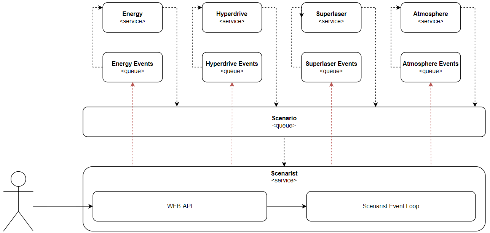

# Устав штурмовика

Штурмовик!

Под непоколебимой и всевластной рукой Нашего Императора да возрадуешься ты и последуешь Его Воле, неостановимый, несокрушимый, частью Длани Карающей Императора являющийся!

Дабы следовать Его Воле, ознакомься с особенностями работ на Его величайшем творении — Звезде Смерти!


Ознакомься с элементами Его величества:

- [**Система энергопитания**](https://github.com/andrwnv/death-star-playground/blob/main/docs/units/1_energy_unit.md)
- [**Система генератора атмосферы корабля**](https://github.com/andrwnv/death-star-playground/blob/main/docs/units/2_atmosphere_unit.md)
- [**Cистема гипердвигателя**](https://github.com/andrwnv/death-star-playground/blob/main/docs/units/3_hyper_drive_unit.md)
- [**Cистема суперлазера**](https://github.com/andrwnv/death-star-playground/blob/main/docs/units/4_super_laser_unit.md)


## Правила общения сервисов

Благодаря руке Нашего Всевластного Императора для работы мы используем следующие технологии:

- `GRPC v1.60.0`

По велению Императора эту диковинку мы используем для общения сервисов между собой.

Агрегирующий сервис Звезды Смерти запрашивает телеметрию каждой подсистемы каждые `500-1000 мс`.

Если же подсистема не отвечает, то она признается **аварийной**, что в свою очередь **влечет нестабильную работу все системы**.

Описания протоколов общения находятся в [`/proto`](https://github.com/andrwnv/death-star-playground/blob/main/protos)


- `RabbitMQ v3.12`

Дабы смертные мы могли своевременно получать события, происходящие на корабле, Император привнес нам эту межгалактическую невидаль. Именно благодаря ей мы можем получать события происходящие на корабле.

Если подсистема не реагирует на событие, то она признается **аварийной**, что в свою очередь **влечет нестабильную работу все системы**.

## События системы
### **Сценарные события**
Просто посмотри в каком замечательном формате корабль нам сообщает о своих событиях:
```json
{
    "type_hint": "EVENT",
    "event_type": "UNSTABLE",
    "issued_at_ms": 1706451807,
    "duration_ms": 10000,
    "checksum": "2ea9589da79e4cc89b306e4e34d141a2"
}
```

Штурмовик, давай разберемся с каждым полем данного сообщения для исключения недопониманий:
> `type_hint`

Данное поле отвечает за тип отправленного сообщения, пока что мы получали только `EVENT`, надеемся, что так и будет дальше.

>  `event_type`

Это поле отвечает за тип полученного события, пока что мы наблюдали следующие виды:
- `STABLE` - обозначает, что система начинает стабилизироваться и стремится перейти в свое рабочее состояние
- `UNSTABLE` - обозначает, что какой-то созависимы компонент системы или другой подсистемы вышел или начал выходить из стороя. Из-за этого система нашего корабля перестает функционировать нормально...
- `RAPAIR_REQUIRED` - обозначает, что что-то в системе сломалось и требует срочной починки.

Данное поле дает нам понять, когда система отдала нам информацию о событии (мы смогли расшифровать шифр, оказалось, что это древний `unix time` в миллисекундах. Кто вообще придумал так описывать время....)

>  `duration_ms`

Данное поле дает нам понять сколько вообще событие будет длиться. Обычно это небольшая цифра, но если это `-1`, тогда событие будет длиться вечность, пока мы не найдем причину данного поведения.

>  `checksum`

Вот что-что штурмовик, а это мы так и всё ещё и не смогли расшифровать, какие-то шаманские цифры и буквы. Но с помощью них система как-то реагирует на вражеское вмешательство. Надеемся, что этот шифр всегда будет правильным... От последствий вражеских сообщений аж волосы на руках дыбом встают. Да хранит нас Всевластный Император от этой напасти!

### **Сервисные события**
Не только событиями корабля мы едины.

Каждый из элементов подсистемы также может отправлять события кораблю. Сообщения подсистем представлены следующим форматом:

```json
{
    "type_hint": "EVENT",
    "event_type": "BREAK",
    "issued_by": "ATMOSPHERE_UNIT",
    "issued_at_ms": 1706451807
}
```
>  `type_hint`

Данное поле все также отвечает за тип отправленного сообщения и всё также пока что мы получали только `EVENT`. **Слава Нашему Императору!**

> `event_type`

Это поле отвечает за тип полученного события, пока что мы наблюдали следующие виды:
- `DEAD` - обозначает, что система "умерла", на испытаниях корабля подобные сообщения вели к крайне плачевным последствиям, что и не удивительно... Наверное...
- `BREAK` - обозначает, что какой-то элемент системы сломался и требует срочной починки.
- `REVIVE` - обозначает, что СИСТЕМА ВОССТАЛА ИЗ МЕРТВЫХ, обычно это происходит либо благодаря воле Бога (Нашего Великого, Всевластного Императора), либо всё же наши разгилдяи соизволили починить элементы коробля (но пока их не пнешь ничего делать они не будут...)
- `ATTACKED` - обозначает, что система атакована, не важно чем... не важно кем... Штурмовик!! НАС АТАКУЮТ!!!

>  `issued_by`

Данное поле дает нам понять, какая система отвила нам свое сообщениe. Мы могли лицезреть только такие типы данного поля:

- `ENERGY_UNIT` - обозначает, что `Генератор электроэнергии` отправил событие, соответствующие `event_type`
- `ATMOSPHERE_UNIT` - обозначает, что все только `Генератор атмосферы` отправил событие, соответствующие `event_type`
- `HYPER_DRIVE_UNIT` - обозначает, что все только `Гипердвигатель` отправил событие, соответствующие `event_type`
- `SUPER_LASER_UNIT` - обозначает, что все только `Cистема суперлазера` отправил событие, соответствующие `event_type`

>  `issued_at_ms`

Все также информация о том, когда система отдала нам информацию о событии и всё также это доисторический `unix time`... Почему они его используют для нас все такая же загадка...

---

# Общая схема взаимодействия посредством очередей сообщений


